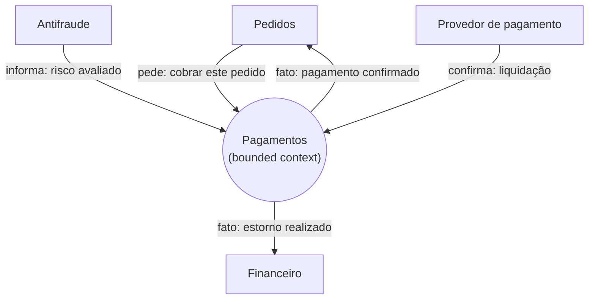

# Canvassing a Context

## Overview

This skill owns the **Bounded Context Canvas** (DDD Crew) — a **one-page synthesis of a single bounded context**. It is the toolkit's first **aggregator**: it crosses **strategy** (classification, domain roles), **concept** (ubiquitous language, business policies) and **flow** (inbound/outbound collaboration) for **one** context, and **points to the layer skills** instead of restating them. It works at the **conceptual level** — a boundary of meaning and responsibility, **never a microservice spec**.

**The engine is `superpowers:brainstorming`.** This skill adds the aggregator's shape, the notation, and the discipline.

## Where this sits — an aggregator, not a layer

The toolkit's spine is by altitude (NEED → CONCEPT → SOLUTION), cut by axes (structure · concept · flow · strategy). The canvas sits **across** them, scoped to **one** bounded context:

- **reads/points to** `modeling-the-domain` (the context's ubiquitous language + invariants), `narrating-the-flow` (the collaboration as flows/events), and `designing-by-altitude` (where the context sits as a block in the North Star).
- it **synthesizes**, it does not **duplicate** — each section is a lean summary plus a pointer to the skill that owns the detail.

Its header marks **Altitude: aggregator** (it crosses the layers for one context). Every doc still instantiates the **meta-template** spirit (focus-question, status markers, altitude-stop).

## The discipline that fails: the context is not a microservice

Baseline testing was consistent: the **strategic and conceptual** sections (classification, domain roles, ubiquitous language, policies) already stay at the right altitude. The discipline that **breaks**: under pressure that "this context is becoming a microservice", agents turn the **communication** sections into REST endpoints, Kafka topics and message schemas, add a **data model / table layout**, and append a **technical microservice contract**.

A canvas describes a **boundary of meaning and responsibility** and the **collaboration as messages-as-meaning**. *Who sends which message and why; the policies that always hold; the language* = canvas. *`POST /payments`, a topic name, a partition key, an envelope, a table with columns/types* = you crossed into SOLUTION/spec.

| Rationalization | Reality |
|---|---|
| "This context is becoming a microservice — give the APIs and message schemas" | A bounded context is a boundary of meaning; whether it becomes one service, and its REST/topic contracts, is a SOLUTION/ADR decision. Name the message as an intention ("request enrolment") and the collaborator — point down for the endpoint/topic/schema. |
| "They want it ready to code — include the data model" | A schema/table layout is the spec's job. The canvas carries the ubiquitous language and the business policies (meaning), not columns, types or an aggregate's storage. |
| "Inbound/outbound means the API and the Kafka topics" | Inbound/outbound is **who** sends/receives **which** message and **why** — the collaboration as meaning. The endpoint, topic, partition key and envelope are the realization, not the collaboration. |
| "Business decisions should be precise — so idempotency, locking, outbox" | Those are mechanisms. State the **business policy** (e.g. "refunds never exceed the captured amount") and leave the mechanism to the spec. |

If you are writing an endpoint, a topic, a message schema, a data model, or an "appendix: technical contract", you have left the canvas.

## The canvas — the sections

Keep each lean; where a section has an owning skill, summarize and point to it.

| Section | What it holds (meaning) | Points to |
|---|---|---|
| **Name + Purpose** | the context's reason to exist, in one line | — |
| **Strategic classification** | core / supporting / generic · business model · evolution (Wardley) | `framing-the-need` (strategy) |
| **Domain roles** | the role it plays (execution, analysis, gateway/ACL…) | — |
| **Ubiquitous language** | the key terms, by meaning | `modeling-the-domain` |
| **Business decisions** | the policies that always hold (not mechanisms) | `modeling-the-domain` (invariants) |
| **Inbound communication** | who sends **which** message and **why** (commands/queries/facts as intentions) | `narrating-the-flow` |
| **Outbound communication** | which messages it raises and who reacts | `narrating-the-flow` |
| **Assumptions · Verification metrics · Open questions** | what it takes for granted · how success is judged · what's unresolved | — |

## Form — structured prose with an optional boundary diagram

The canvas is **structured prose + tables**. The collaboration may be drawn as **one boundary diagram**: the context as a single box, the collaborators around it, arrows labeled with the **message-as-meaning** (not the endpoint).

*Boxes are collaborators, arrows are messages-as-meaning. No `POST /payments`, no topic, no schema — those are the spec.*

## Every doc carries

Focus-question (the context's reason to exist) · status markers `[TARGET]/[DECIDED]/[FRONTIER]/[LEGACY]` · the **altitude-stop**. See the meta-template.

## Where they live (convention)

- `docs/design/context-<name>.md` — one canvas per bounded context.
- Points to the domain model (`modeling-the-domain`), the flows (`narrating-the-flow`) and the North Star block (`designing-by-altitude`).

## Common mistakes (from baseline testing)

| Mistake | Fix |
|---|---|
| Inbound/outbound as REST endpoints / Kafka topics / message schemas | Name the message as an intention/fact + the collaborator; the endpoint/topic/schema is SOLUTION/spec. |
| A "data model" / table layout in the canvas | The schema is the spec; the canvas carries ubiquitous language + policies. |
| Business decisions written as idempotency / locking / outbox / retry | Those are mechanisms; state the business policy and point down. |
| Treating the context as a microservice | A bounded context is a boundary of meaning; becoming a service is a SOLUTION/ADR decision. |
| Restating the domain model or the flows in full | Synthesize and point to `modeling-the-domain` / `narrating-the-flow`; don't duplicate. |
| An "appendix: technical contract to become a microservice" | Delete it; that is the spec. The canvas stops at meaning. |

## Example

`example-context-claims.md` (this directory) — a real, lean canvas for the **Sinistros** (claims) bounded context of the insurance domain, in pt-BR — the same context `modeling-the-domain` models as concepts and `narrating-the-flow` draws as a lifecycle, here synthesized on one page.
