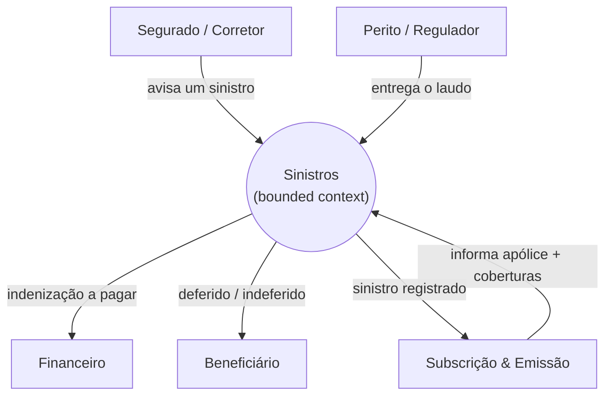

<!--
EXAMPLE for the `canvassing-a-context` skill — the AGGREGATOR (Bounded Context Canvas).
A lean one-page canvas in pt-BR (body) with canonical English status markers. Study the SHAPE:
strategy (classification, domain roles), concept (ubiquitous language, business policies), flow
(inbound/outbound as messages-as-MEANING — intentions/facts, not endpoints/topics/schemas), an
optional boundary diagram, an explicit altitude-stop, and pointers to the LAYER SKILLS — and not a
single endpoint, topic, message schema or data model. The canvas SYNTHESIZES and points to
modeling-the-domain / narrating-the-flow instead of duplicating them. Domain: insurance — the
Sinistros (claims) bounded context, the same context modeled as concepts and drawn as a lifecycle
elsewhere in this toolkit.
-->

# Bounded Context Canvas — Sinistros (Seguros)

> **Altitude:** agregador (cruza estratégia · conceito · fluxo de **um** contexto) · **Status:** [TARGET] · **Data:** 2026-06-22
> **Pergunta-foco:** Qual a razão de existir do contexto de Sinistros, e como ele colabora com os vizinhos — em significado, não em contratos técnicos?
> **Aponta para:** `north-star:modeling-the-domain` (linguagem ubíqua + invariantes) · `north-star:narrating-the-flow` (ciclo de vida do Sinistro) · `north-star:designing-by-altitude` (onde Sinistros entra no North Star).

Esta é uma síntese de **uma página** do contexto. Carrega **significado e colaboração**; endpoints, tópicos, schemas e modelo de dados são realização — ver §12 e §13.

## 1. Nome + Propósito

**Sinistros.** Apurar, decidir e liquidar o que a seguradora deve quando um risco coberto se materializa — do **aviso** do segurado até a **indenização** paga ou a **negativa** fundamentada. É a fronteira onde a **promessa da apólice se cumpre** (ou se afasta, com justificativa).

## 2. Classificação estratégica

| Dimensão | Classificação | Por quê |
|---|---|---|
| **Domínio** | **Core** | É onde a seguradora entrega (ou não) o que vendeu; a qualidade da regulação é diferencial e a maior fonte de perda/fraude. |
| **Modelo de negócio** | Cumprimento da promessa + controle de perda | Pagar o justo, rápido; afastar o indevido. |
| **Evolução (Wardley)** | Custom-built | As regras de regulação e enquadramento são próprias; partes (peritagem, antifraude) tendem a produto. |

## 3. Papéis de domínio

- **Execution** — conduz a regulação: apura cobertura, quantifica e decide.
- **Gatekeeper** — afasta o que não tem cobertura (vigência, carência, exclusão) ou indício de fraude.

## 4. Linguagem ubíqua (resumo — significado completo em `modeling-the-domain`)

**Sinistro** (o evento **e** o caso/processo) · **Regulação** (apuração de cobertura e valor) · **Indenização** (o que se paga ao beneficiário) · **Franquia** · **Importância segurada** · **Cobertura**. Os significados precisos, o "não confundir com" e a polissemia (*prêmio* ≠ *indenização*) vivem no modelo de domínio — aqui só se referenciam.

## 5. Decisões de negócio (políticas que sempre valem — não mecanismos)

1. Um sinistro só é **indenizável** se ocorreu na vigência, enquadra-se numa cobertura, está fora de carência e não recai em exclusão.
2. A **indenização nunca excede** a importância segurada da cobertura acionada, já descontada a franquia.
3. **Nenhuma indenização sem regulação** — não se paga o que não foi apurado.
4. O **caso começa no aviso** (a ciência da seguradora), não no evento em si.
5. Uma negativa é sempre **fundamentada** e **contestável** pelo beneficiário.

*(Como garantir atomicidade, idempotência ou trilha de auditoria é mecanismo — pertence ao spec.)*

## 6. Comunicação de entrada (inbound) — *quem manda qual mensagem e por quê*

| Colaborador | Mensagem-intenção | Por quê |
|---|---|---|
| Segurado / Corretor | "avisar um sinistro" | Um evento possivelmente coberto ocorreu; abre o caso. |
| Subscrição & Emissão | "informar a apólice e coberturas vigentes" | Base para enquadrar o sinistro. |
| Perito / Regulador (externo) | "entregar o laudo da apuração" | Sustenta a decisão de cobertura e valor. |

## 7. Comunicação de saída (outbound) — *quais mensagens levanta e quem reage*

| Mensagem-intenção / fato | Quem reage |
|---|---|
| "indenização a pagar" | Financeiro / Cobrança — liquida ao beneficiário. |
| "sinistro deferido / indeferido" | Beneficiário, Notificações — comunica o desfecho. |
| "sinistro registrado" | Subscrição — alimenta sinistralidade e renovação. |
| "exposição acima do limite de retenção" `[FRONTIER]` | Resseguro — aciona o ressegurador. |

## 8. Fronteira (significado, não realização)

*Caixas são colaboradores, setas são mensagens-significado. Nenhum endpoint, tópico ou schema — isso é a SOLUÇÃO.*

## 9. Premissas

- Subscrição & Emissão é a fonte da verdade da **apólice/cobertura**; Sinistros a consome, não a altera.
- O **valor segurado e a franquia** chegam da apólice; Sinistros não os recalcula.
- A peritagem externa entrega laudos confiáveis e auditáveis.

## 10. Métricas de verificação

- Tempo **aviso → decisão** (e → liquidação).
- % de sinistros **indeferidos contestados** (qualidade da fundamentação).
- **Sinistralidade** por produto; indício de fraude detectado.

## 11. Questões em aberto

- **Resseguro** `[FRONTIER]` — o acionamento acima do limite é deste contexto ou de um contexto próprio?
- **Antifraude** é capacidade interna da regulação ou um contexto vizinho que Sinistros consulta?
- **Sub-rogação** (cobrar o causador do dano) entra aqui ou em Recuperação?

## 12. PARE AQUI (altitude-stop)

Este canvas para no **significado e na colaboração**. Não desce a: endpoints/APIs, tópicos/filas, schema/envelope de mensagem, modelo de dados/tabelas, a **máquina de estados** detalhada do sinistro (ela vive em `narrating-the-flow`), nem a **fórmula** de cálculo da indenização (spec de pricing). No instante em que aparecer uma rota, um tópico ou uma coluna, saiu do canvas.

## 13. Ponteiros

- **Linguagem ubíqua + invariantes** → `north-star:modeling-the-domain` (`example-domain-model.md`).
- **Ciclo de vida do Sinistro** (situações + acontecimentos) → `north-star:narrating-the-flow` (`example-claim-lifecycle.md`).
- **Posição como bloco** no sistema → `north-star:designing-by-altitude` (North Star).
- **Contratos técnicos** (se o contexto virar um serviço) → ADR + spec de Solução.
