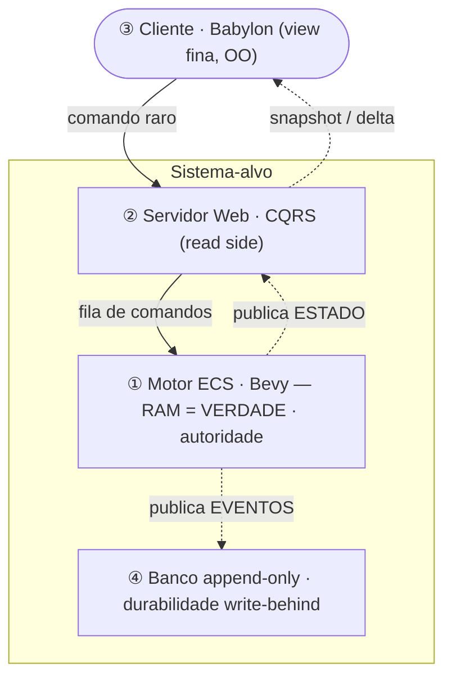
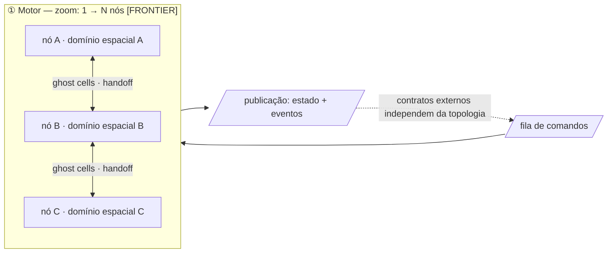

<!--
EXAMPLE for the `designing-by-altitude` skill — the SOLUTION layer, zoom = whole system (North Star).
This is the author's real WTO North Star, in pt-BR (body) with canonical English status markers.
Study the SHAPE of the v2 form: a header (Altitude · Axis · Status · Focus-question), the NEED
distilled at the top, blocks drawn as a Mermaid diagram (+ a zoom diagram), status markers,
alternatives weighed, a risks section, a decision/legacy map, an explicit altitude-stop — and not
a single stack choice in the form. Lean enough to read at the start of every session.
-->

# North Star — Arquitetura-Alvo do WTO

> **Altitude:** SOLUÇÃO · **Eixo:** estrutura · **Status:** [TARGET] · **Data:** 2026-06-22
> **Pergunta-foco:** Para onde a arquitetura do WTO migra — quais blocos existem, que papel cada um cumpre, e por quais contratos se acoplam?

**Projeto:** WTO — tycoon de transporte de cargas, MMO single-shard (mundo único planetário), simulação endógena sempre-viva.
**Natureza:** descreve o **sistema-alvo** (onde queremos chegar), no nível de **blocos e encaixe** — não o código atual, não minúcias de schema.

---

## 0. Como ler este documento

Este é o **North Star**: o ponto fixo que orienta as decisões do dia a dia. Você não "chega" nele — ele diz se uma decisão local está puxando na direção certa. Por isso:

- **Descreve o alvo, não o presente.** Hoje o sistema roda sobre SpacetimeDB (STDB); este doc descreve para onde a arquitetura migra. Os documentos atuais — `arquitetura-mundo-spacetimedb.md`, `fase1-mvp-estradas-emergentes.md` e as fatias 1–8 — são o `[LEGACY]` que este alvo conscientemente supera.
- **Altitude-stop.** Blocos, contratos entre eles, princípios e "onde mora a verdade". Schema, código e escolhas de tecnologia de cada bloco **não** entram aqui — viram ADRs/specs próprios. No diagrama: caixas são papéis, setas são intenções.
- **É constituição + índice.** Os ADRs são as emendas pontuais; os docs de design são o detalhamento. Este doc aponta para eles (§6).

**Status markers:** `[TARGET]` = desejado, não implementado · `[DECIDED]` = firmado em ADR · `[FRONTIER]` = aposta ainda em pesquisa · `[LEGACY]` = existe hoje, será superado.

---

## 1. Propósito e princípios invioláveis  *(distila o NEED)*

O WTO é um simulador econômico de transporte, **single-shard planetário**, jogado de forma **assíncrona** por administradores não-twitch — o cliente é um "Google-Maps no tempo do servidor". O gargalo é **endógeno**: o custo vem da própria simulação (agentes ativos, estigmergia), não de input de jogadores. Isso faz do WTO o melhor caso para uma simulação distribuível.

Os princípios que toda decisão deve respeitar:

**Fundadores (a tese deste alvo):**
1. **O motor de simulação é a autoridade; a RAM é a verdade.** Estado quente vive em memória (in-memory-first).
2. **O banco é durabilidade write-behind** — "salva-vidas" fora do caminho crítico, nunca no caminho da escrita quente.
3. **O motor é um produtor desacoplado:** não conhece seus consumidores (publish-subscribe / log unificado).
4. **Entrada e saída desacopladas:** comandos entram por **fila** (drenada no tick); estado e eventos saem por **publicação**. O motor nunca é chamado direto.
5. **Consumidores plurais, propósitos distintos:** o read side quer *estado*; a persistência quer *eventos*.
6. **O cliente é uma view fina** que interpola entre pontos discretos publicados pelo servidor.

**Herdados (continuam valendo, e foi o que pré-pagou esta virada):**
7. **Regras de jogo são Rust puro no crate `shared`** — sem acoplamento ao runtime. Foi a disciplina que tornou a saída do STDB viável.
8. **A simulação é endógena e sempre-viva** — não há cull por observador; o mundo simula exista ou não alguém olhando.
9. **Escrita só em evento discreto** (a "regra de ouro") — nunca por frame/posição contínua.

**Estruturais (consequência do modelo):**
10. **Dois regimes de estado:** o **discreto** (economia, comandos, construção) é *event-sourced* e auditável; o **campo contínuo** (estigmergia, milhões de células) é *materializado e snapshotado* — logar célula-a-célula seria inviável.
11. **A simulação é determinística** — habilita replay, reconstrução e auditoria a partir do log.

---

## 2. A virada: por que sair do SpacetimeDB

`[DECIDED 2026-06-22]` O STDB sai por completo da arquitetura-alvo — não só do papel de motor (como previa o ADR 0003), mas inteiro. Três razões, todas convergentes:

1. **Single-writer / teto de escala.** O escritor serial único é um teto fundamental (joelho medido ~2–3k na fatia 8). A simulação massiva precisa de **N escritores paralelos de verdade**.
2. **O modelo "banco-como-runtime" (módulo WASM) engessa o ECS.** A simulação quer ser um motor Bevy paralelo/distribuível (domain decomposition + ghost cells); viver dentro do banco limita esse motor.
3. **Lock-in / maturidade.** Produto novo, proprietário, que muda muito — risco estratégico para a fundação de um projeto de anos.

As três apontam para a mesma direção: **a simulação massiva deve viver num motor próprio, em Rust, paralelo/distribuível, que governamos.** A saída foi **pré-paga** pela disciplina das regras puras em `shared` (princípio 7): migra-se o adaptador, não as regras.

---

## 3. O sistema-alvo: blocos e encaixe

*Setas tracejadas = publicação desacoplada; o motor não chama ninguém (princípio 3).*

### ① Motor de simulação (Bevy ECS) — `[DECIDED: Bevy, ADR 0004]`
A autoridade. Mantém o estado do mundo em RAM (a verdade), drena a fila de comandos no início de cada tick, simula (paralelo intra-nó — medido na fase B), e publica o resultado no fim do tick. **Não conhece quem consome.** Depende apenas do crate `shared` para as regras.

**Zoom — escala distribuída `[FRONTIER]`.** Internamente, o motor escala de 1 nó para **N nós** via *domain decomposition* + *ghost cells* + *handoff* inter-nó. O paralelismo **intra-nó** está medido (fase B); o **inter-nó** ainda é fronteira de pesquisa. Crucialmente, os contratos externos (fila na entrada, publicação na saída) **independem** dessa topologia:

### ② Servidor web / read side (CQRS) — `[TARGET]`
Assume o papel que o STDB tem hoje na conversa com o cliente. Consome a publicação de **estado** do motor (área de interesse) e serve os clientes. Valida e enfileira os comandos que chegam do cliente. É o lado de leitura do CQRS — escala independentemente do motor.

### ③ Cliente (Babylon.js / TS) — `[DECIDED: ADR 0001]`
View fina, orientada a objetos. Recebe snapshots/deltas do servidor web e **interpola** a posição entre pontos discretos (mesma filosofia do movimento atual: `departed_at`→`arrival_at`). Emite comandos raros (admin não-twitch).

### ④ Banco append-only — `[TARGET]`
Consumidor de primeira classe, **lado a lado** com o servidor web, mas com propósito diferente: **permanência**. Consome a publicação de **eventos** do motor e os persiste (event sourcing para o domínio discreto; snapshots para o campo contínuo). É o "salva-vidas" — write-behind, fora do caminho crítico.

### Os contratos (as setas), como significado
- **Comando (entrada):** cliente → servidor web (valida) → **fila de comandos** → motor drena no início do tick e aplica de forma autoritativa. O player vê o efeito no próximo snapshot.
- **Publicação (saída):** no fim do tick o motor publica um fluxo de mudanças; consumidores o interpretam conforme seu propósito (web lê *estado*, banco lê *eventos*). Padrão: **log unificado / produtor-consumidor** (cf. "The Log", Kreps).
- **Durabilidade:** assíncrona, RAM-first. Implica uma **janela** em que a RAM avançou e o banco ainda não persistiu — ver risco em §5.

---

## 4. Estratégia de realização

A espinha é **CQRS + arquitetura log-centrada + in-memory-first**: um motor autoritativo em memória no centro, produzindo um fluxo de mudanças que alimenta consumidores desacoplados (read e persistência).

- **Dois regimes de estado** (princípio 10) governam *como* se persiste: AOF/event-log para o discreto, snapshot para o campo.
- **Tecnologia de cada bloco fica em aberto** (§5) — o North Star fixa o *encaixe*, não as ferramentas.
- **Migração faseada a partir do legado STDB.** Este doc descreve o destino; o caminho (quais fatias migram, em que ordem, com qual ponte) é trabalho futuro de spec/plano, não deste documento.

---

## 5. Riscos e decisões em aberto

- **Você passa a manter o que o STDB dava de graça:** durabilidade, replicação, queries e scheduling viram responsabilidade sua. Mais superfície de código e de falha.
- **Janela de durabilidade:** crash entre publicar e persistir perde o que estava só na RAM. → Política de "confirmado" para o domínio financeiro (dinheiro só confirmado ao jogador após o banco gravar).
- **Volume de publicação e interest management:** snapshot/delta para N clientes precisa de filtragem por área de interesse (herda o problema de particionamento do legado).
- **Handoff inter-nó `[FRONTIER]`:** a decomposição distribuída e a área de interesse cruzando fronteiras de nó ainda não estão provadas.
- **Tecnologias em aberto (viram ADRs, não entram cravadas aqui):** transporte da replicação motor→web→cliente (ex.: WebSocket/WebTransport/Lightyear); qual banco append-only; formato do snapshot/delta; mecanismo da fila de comandos.

---

## 6. Mapa de decisões e legado

- **ADRs vigentes:** [0001] cliente Babylon · [0004] Bevy como ECS · [0003] papel do STDB — **atualizado/superado** por este North Star (§2).
- **ADR a criar:** "Saída do SpacetimeDB" (formaliza §2).
- **Evidência que sustenta a virada:** spike motor paralelo (single-thread já 4–7× a fatia 8); 2º spike ECS Bevy (gate verde); fase B (paralelismo intra-nó ~4–5×, determinismo verde).
- **Legado a superar `[LEGACY]`:** `docs/arquitetura-mundo-spacetimedb.md`, `docs/fase1-mvp-estradas-emergentes.md`, fatias 1–8 (todas sobre STDB).

---

## Referências conceituais

- **The Log** — Jay Kreps (arquitetura log-centrada / produtor-consumidor).
- **CQRS** e **Event Sourcing** — separação leitura/escrita; estado derivável de um log de eventos.
- **In-memory-first com persistência write-behind** — padrão Redis (AOF + RDB).
- **arc42** — a estrutura deste doc é um subconjunto enxuto: §1, Context+Building Blocks (§3), Solution Strategy (§2+§4), Decisions (§6), Risks (§5).
