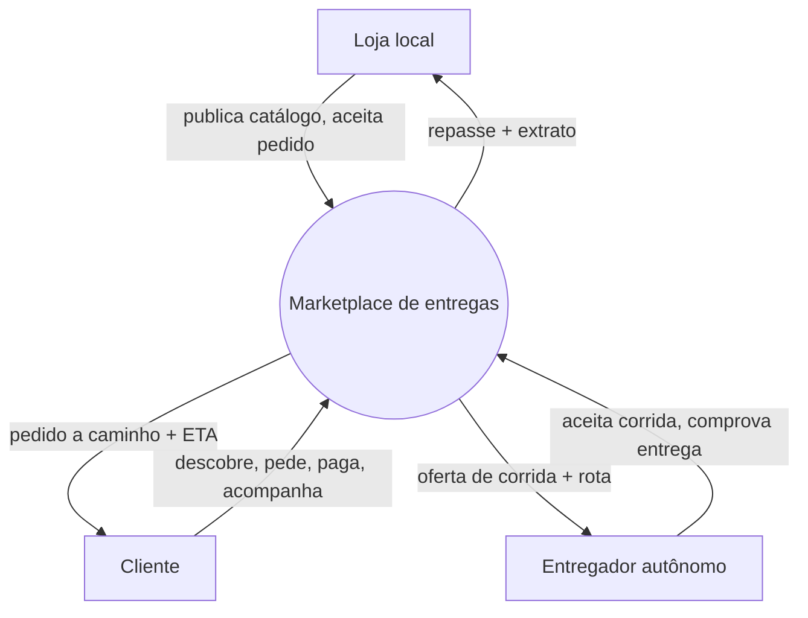

# Framing the Need

## Overview

This skill owns the **NEED** layer — the **problem before any form**: why the system exists, for whom, the **capabilities and outcomes** it must deliver, and the **system as a black box** at its boundary. NEED is the top of the spine — it reads nothing above; CONCEPT and SOLUTION read it. Living **design-as-context**.

**The engine is `superpowers:brainstorming`.** This skill adds the altitude (NEED), the target shape, the notation, and the discipline.

## Where this sits — the altitude spine

```
NEED      the problem, before any form     ← THIS SKILL  (why · for whom · capabilities · boundary)
  ↓ read by
CONCEPT   the mental model of the domain   (north-star:modeling-the-domain)
  ↓ read by
SOLUTION  the conceptual form              (north-star:designing-by-altitude)
═══ altitude-stop ═══   modules · services · APIs · screens · schema · tech · ADR · spec
```

NEED is the **top**: it reads nothing above; CONCEPT distills it and SOLUTION distills it. Until NEED docs exist, the North Star distills the need inline. Every doc instantiates the **meta-template** (`templates/meta-template.md`).

## The discipline that fails: stay at the problem

Baseline testing showed agents already stay at the problem when asked plainly for "the problem and for whom" — one even drew the need/solution line itself. The discipline that **does** break: under pressure to be **concrete** ("the team wants something to build", "they want to leave knowing the modules and how they fit"), agents **descend into SOLUTION** — opening the system into internal services, APIs, events, state machines, or naming concrete channels (WhatsApp/SMS, a link/page).

A need describes **why, for whom, and what the system must be able to do** — as a black box. *Capability, outcome, boundary contract* = NEED. *"becomes a service / an API / an event / a screen / a state machine"* = you crossed into SOLUTION.

| Rationalization | Reality |
|---|---|
| "The team wants something concrete and actionable, ready to build" | At this altitude the actionable thing is a sharp problem and the capabilities that close it. The moment you name a channel (WhatsApp/SMS) or a screen, you have answered "what form?" — the SOLUTION's job, and it rots the need doc. |
| "They want to leave knowing what we'll build — the modules and how they fit" | A capability is what the system must **do**, as a black box. Which services deliver it and how they talk (APIs/events) is a SOLUTION/ADR decision — name the capability and the boundary contract, leave a pointer. |
| "Being abstract goes nowhere" | The need earns its keep as the bar every later module is judged against — *does this serve the capability?* Drawing the modules now just freezes one answer before the problem is agreed. |

If you are naming internal modules, services, APIs, events, screens, or a state machine, you have left this altitude.

## Form — structured prose with Mermaid

NEED is mostly the **strategy** axis — **prose + tables**, no shelf diagram (optionally a `quadrantChart` for a Wardley / positioning view). The one axis that draws is **boundary capabilities** (structure): the system as **exactly one black box**, the external actors around it, and the **boundary contracts** as labeled arrows — what each actor needs from it and offers it.

- `flowchart` with a **single** system node + actors; arrows are **boundary intentions**, never internal calls.
- **Never open the box.** The moment a second internal box appears (a service, a module), you have drawn the SOLUTION.



*One box, named by what it does for the actors. No Orders / Payments / Dispatch service — those are the SOLUTION (`north-star:designing-by-altitude`).*

## The shape

NEED has a small family of artifacts; pick by the question, keep each lean:

- **PR-FAQ / vision** — the why and for whom: the problem, who hurts, the future press release, the hardest questions. (Amazon Working Backwards.)
- **Impact Map** — Why → Who (actors) → How (impacts on their behavior) → What (deliverables), as a tree. Keeps every deliverable tied to a goal. (Gojko Adzic.)
- **Wardley Map** — the value chain × evolution; where to invest and the strategic move. (Simon Wardley.) Optional `quadrantChart`.
- **Boundary capabilities + contracts** — the system as a black box: the capabilities it must expose and the contract at each boundary (meaning, not API). (ARCADIA System Analysis.)

## Every doc carries

Focus-question · status markers `[TARGET]/[DECIDED]/[FRONTIER]/[LEGACY]` · **reads nothing above** (NEED is the top — the as-is / current stack is `[LEGACY]` context you cite, not the need) · the **altitude-stop**. See the meta-template.

## Where they live (convention)

- `docs/design/need.md` — the framing (or `docs/design/need-<aspect>.md` — vision, impact, capabilities).
- Read by the North Star (SOLUTION) and the domain model (CONCEPT), which distill it.

## Common mistakes (from baseline testing)

| Mistake | Fix |
|---|---|
| A "modules / services and how they fit" section | Stop at capabilities + boundary contracts; the services are SOLUTION/ADR. |
| Capabilities opened into internal services, APIs, events | One black box; name what it does for actors, point down for the rest. |
| Naming concrete channels/screens (WhatsApp/SMS, a link/page) | The channel is a form decision; the need is the outcome (reach the patient, cut no-show). |
| Anchoring the need in the running prototype/stack | The stack is `[LEGACY]` context; the need is the problem it answers. |
| Boundary diagram with a second internal box | NEED draws one box; a second box is the SOLUTION. |
| Deliverables with no goal above them | Tie each to the why — Why → Who → How → What (Impact Map). |

## Example

`example-need-marketplace.md` (this directory) — a real, lean NEED doc: boundary capabilities for a delivery marketplace, in pt-BR, with the as-is held as `[LEGACY]`.
