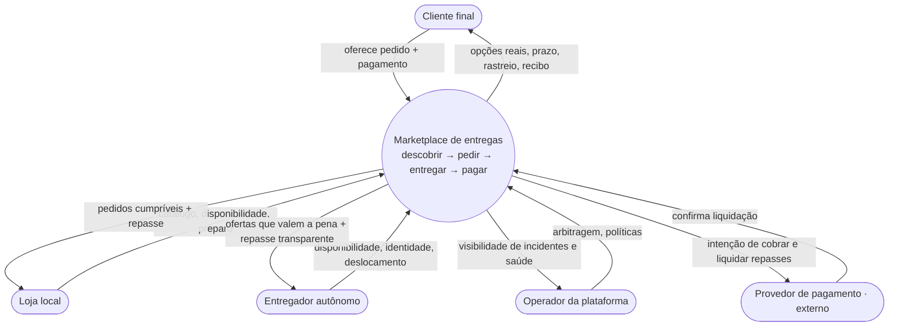

<!--
EXAMPLE for the `framing-the-need` skill — the NEED layer (top of the spine), axis = boundary capabilities (structure).
A lean NEED doc in pt-BR (body) with canonical English status markers. Study the SHAPE: header
(Altitude · Axis · Status · Focus-question · reads nothing above), purpose + for-whom, capabilities
as black-box BEHAVIOR (what, not how), the system as EXACTLY ONE black box in a Mermaid flowchart
(actors + boundary contracts as labeled arrows, never an internal service), alternatives, open
questions, an explicit altitude-stop, pointers down — and not a single internal module, service, API,
event, screen, schema or tech. The as-is is held as [LEGACY]. Domain: a delivery marketplace — the
same domain a cold agent opened into ten internal services, drawn here at the right altitude.
-->

# Necessidade — Marketplace de Entregas

> **Altitude:** NEED (o topo — o problema antes da forma) · **Eixo:** estrutura (capacidades de fronteira) · **Status:** [TARGET] · **Data:** 2026-06-22
> **Pergunta-foco:** O que este sistema precisa ser capaz de fazer para que uma loja local venda além do balcão, um entregador autônomo ganhe pelo seu tempo e um cliente receba o pedido certo no prazo — sem que os três precisem se conhecer de antemão?
> **Lê acima:** — (NEED é o topo; não lê nada acima. O arranjo manual de hoje é contexto `[LEGACY]`, não a necessidade.)

Este documento descreve **por quê, para quem e o que o sistema precisa ser capaz de fazer** — tratando o sistema como **uma única caixa-preta**. Não há módulos, serviços, APIs, eventos, telas, schema ou tecnologia aqui — ver §6 e §7.

## 1. Propósito

Hoje, vender fora do balcão depende de arranjos manuais e frágeis — telefone, mensagem, um conhecido com moto `[LEGACY]`. Não há descoberta (o cliente não sabe quem entrega perto), nem prazo previsível, nem repasse confiável ao entregador. Cada elo resolve seu pedaço; ninguém garante a ponta a ponta. O sistema existe para ser o **intermediário de confiança** que conecta três lados que não se conhecem e fecha o ciclo: **descobrir → pedir → entregar → pagar → repassar**, com prazo previsível e saída justa quando algo dá errado.

**Quem lê:** o time, ao decidir o que entra no alvo e ao julgar se um bloco futuro serve a uma capacidade. **Quando:** antes de qualquer spec, e como contexto no início de cada sessão.

## 2. Premissas / entrada

- **Lê acima:** — (é o topo da espinha).
- **Atores na fronteira:** **Cliente final**, **Loja local**, **Entregador autônomo**, **Operador da plataforma** (interno, media e contém abuso) e **Provedor de pagamento** (externo — liquida, é fronteira, não faz parte do sistema).
- **Premissa de mercado a validar:** densidade de oferta (entregadores ativos por região) suficiente para o casamento de corridas funcionar; sem ela, a capacidade C4 não fecha.

## 3. Capacidades e fronteira

Cada capacidade é **comportamento da caixa-preta** (o quê), não peça interna (o como).

| # | O sistema deve ser capaz de… | Resultado que fecha | Status |
|---|---|---|---|
| C1 | **Tornar lojas e itens descobríveis** por proximidade e disponibilidade real | Cliente encontra opções que podem atendê-lo agora | `[TARGET]` |
| C2 | **Receber e acompanhar um pedido**, do toque ao "chegou" | Cliente sabe o estado e o prazo a qualquer momento | `[TARGET]` |
| C3 | **Refletir a disponibilidade da loja** (aberta, item em falta, tempo de preparo) | Pedido só é aceito quando pode ser cumprido | `[TARGET]` |
| C4 | **Casar uma entrega a um entregador adequado** e ofertá-la | Pedido sai sem espera; entregador recebe corridas que valem a pena | `[TARGET]` |
| C5 | **Dar visibilidade da entrega em andamento** aos três lados | Confiança; menos "cadê meu pedido?" | `[TARGET]` |
| C6 | **Cobrar o cliente e repassar a loja e ao entregador** de forma confiável | Dinheiro chega a quem é devido, sem acerto informal | `[TARGET]` |
| C7 | **Sustentar a confiança entre desconhecidos** (identidade verificada, reputação) | Os três lados aceitam transacionar sem se conhecer | `[TARGET]` |
| C8 | **Resolver o que dá errado** (atraso, item trocado, cancelamento, não-comparecimento) | Incidente tem caminho de saída justo, sem perder o cliente | `[TARGET]` |
| C9 | **Definir a regra de precificação e repasse** (taxa, frete, gorjeta) | Modelo sustentável e percebido como justo | `[FRONTIER]` |

**Resultados-âncora (a régua de sucesso):** o pedido certo chega no prazo prometido; a loja vende além do balcão sem retrabalho; o entregador maximiza ganho por hora; os três lados percebem a plataforma como justa.

### O sistema como caixa-preta — fronteira e contratos

Uma única caixa. As setas são **intenções de fronteira** (o que cada ator precisa do sistema e o que oferece a ele) — nunca chamadas internas.

*Uma caixa, nomeada pelo que faz para os atores. Não há serviço de Pedidos / Pagamentos / Despacho — isso é a SOLUÇÃO (`north-star:designing-by-altitude`).*

| Ator | Precisa do sistema | Oferece ao sistema |
|---|---|---|
| Cliente | Opções reais, prazo confiável, rastreio, recibo | Pedido e pagamento |
| Loja | Pedidos que consegue cumprir + repasse confiável | Catálogo, disponibilidade, preparo |
| Entregador | Ofertas que valem a pena + repasse transparente | Disponibilidade, identidade, deslocamento |
| Operador | Visibilidade de incidentes e da saúde dos três lados | Arbitragem e políticas |
| Provedor de pagamento | — (externo) | Liquidação de cobrança e repasse |

## 4. Alternativas + trade-offs

- **Marketplace de três lados** `[TARGET]` vs. **agregador de dois lados** (loja + cliente, com entrega terceirizada a um parceiro logístico). *Escolhido três lados:* a confiança no entregador e o repasse transparente **são parte do problema** — terceirizar a entrega empurraria C4/C6/C7 para fora e descaracterizaria o valor.
- **Precificação/repasse fixos** vs. **dinâmicos** (por demanda/distância). *Em aberto* `[FRONTIER]` — é uma decisão de necessidade (qual modelo é justo e sustentável), anterior a qualquer fórmula, que é forma.

## 5. Limitações / questões em aberto

- **C9 precificação/repasse** `[FRONTIER]` — qual modelo é percebido como justo pelos três lados sem inviabilizar a margem. A definir antes da forma.
- **Antifraude nos três lados** `[FRONTIER]` — conter golpe de loja, de entregador e de cliente; o limite entre fricção e segurança é necessidade, não ainda mecanismo.
- **Densidade de oferta** — premissa de mercado (§2); sem entregadores suficientes, C4 não fecha. Validar cedo.

## 6. PARE AQUI (altitude-stop)

Este documento para no **problema e nas capacidades**. O time pediu para sair daqui "sabendo os módulos/serviços e como se encaixam" — e este doc **conscientemente não os define**. Tudo que responde *"qual forma?"* pertence à camada abaixo: a decomposição em serviços, **APIs/eventos**, a **máquina de estados** do pedido, as **telas**, o **schema** e a **tecnologia**. Desenhar os módulos agora **congelaria uma resposta antes de o problema estar acordado**. No instante em que aparecer um segundo bloco interno no desenho, ou o nome de um serviço, você saiu da altitude — nomeie a **capacidade** e o **contrato de fronteira**, e deixe um ponteiro.

## 7. Ponteiros para baixo

- **A decomposição em blocos e contratos internos** → North Star (`north-star:designing-by-altitude`, camada SOLUÇÃO), que distila estas capacidades.
- **O significado dos conceitos** (Pedido, Corrida, Repasse como significado e invariantes) → modelo de domínio (`north-star:modeling-the-domain`, camada CONCEITO).
- **Precificação/repasse e antifraude** `[FRONTIER]` → specs/ADRs próprios, quando a forma for decidida.
