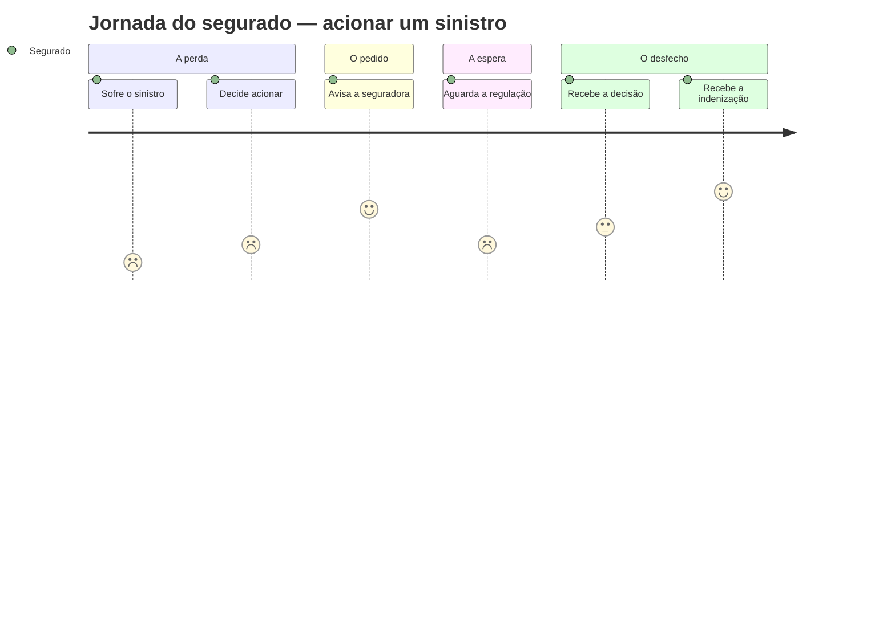

<!--
EXAMPLE for the `mapping-the-journey` skill — the EXPERIENCE axis (customer journey).
A lean journey in pt-BR (body) with canonical English status markers. Study the SHAPE: a table by
stage (does · thinks/feels · touchpoint-as-MEANING · pain/opportunity), the emotional curve (a Mermaid
`journey` diagram), the moments of truth, an explicit altitude-stop, pointers down — and not a single
screen, field, click-flow or named system. Touchpoints are points of contact as meaning, not screens.
Domain: insurance — the *segurado* filing a claim, the outside-in complement of the system-centric
`claim-lifecycle` (the same process, inside-out, in narrating-the-flow).
-->

# Jornada do Segurado — Acionar um Sinistro

> **Altitude:** experiência (eixo, ancorado no NEED) · **Status:** [TARGET] · **Data:** 2026-06-22
> **Pergunta-foco:** O que o segurado vive, precisa e sente ao acionar um sinistro — da perda ao desfecho?
> **Lê acima (NEED):** a promessa do seguro — amparo na hora da perda. **Complementa** (outside-in) o `claim-lifecycle` (`north-star:narrating-the-flow`), que é o mesmo processo visto de dentro (as situações do caso).

Este mapa descreve o que o segurado **vive, precisa e sente**. Os touchpoints aparecem como **significado** (canal + intenção), não como telas; o "bastidor" (a regulação) é o `claim-lifecycle` — ver §  ponteiros.

## A jornada, etapa a etapa

| Etapa | O que faz | O que pensa / sente | Touchpoint (significado) | Dor / Oportunidade |
|---|---|---|---|---|
| **1. A perda** | Sofre o evento (batida, roubo, dano) | Choque, estresse, impotência | — (ainda não há contato; o seguro vem à mente) | Está fragilizado; **oportunidade:** ser fácil de acionar quando ele menos tem cabeça para burocracia |
| **2. Decidir acionar** | Lembra que tem seguro e pondera acionar | "Será que cobre? Vou perder o bônus? Vale a pena?" — dúvida | Busca entender se está amparado | Medo de não cobrir / de complicar; **oportunidade:** clareza sobre o que é coberto |
| **3. Avisar** | Comunica o sinistro à seguradora e relata o ocorrido | Esperança de amparo + receio de burocracia | Pede socorro — entrega sua confiança no momento frágil | Aviso difícil/repetitivo na hora errada; **oportunidade:** acolher com simplicidade |
| **4. Aguardar a regulação** | Envia documentos, aguarda a apuração | Ansiedade, limbo, sensação de estar "no escuro" | Espera um veredito sobre a sua perda | **Maior dor:** silêncio e incerteza de prazo; **oportunidade:** transparência do andamento |
| **5. Saber o desfecho** | Recebe a decisão (deferido / indeferido) | Alívio (deferido) ou indignação (indeferido) | Recebe a resposta — a seguradora honra (ou nega) a promessa | Negativa sem explicação; **oportunidade:** desfecho claro e, se negado, fundamentado |
| **6. Receber a indenização** | Recebe o pagamento (ou a reparação) | Confiança restaurada — ou frustração se demora | A promessa se cumpre, concretamente | Pagamento lento; **oportunidade:** rapidez é onde o seguro prova seu valor |
| **7. Depois** | Retoma a vida; decide renovar (ou não) | "Valeu a pena ter seguro" — ou "nunca mais" | A experiência vira reputação | Abandono na renovação; **oportunidade:** um bom sinistro fideliza para a vida |

## A curva emocional

*Parte de um vale (a perda), ergue-se na esperança do aviso, **despenca no limbo da regulação**, e o desfecho define se o segurado renova ou abandona.*

## Momentos da verdade

1. **Avisar no momento do choque (3)** — o segurado está fragilizado; a facilidade de pedir socorro define a primeira impressão de amparo.
2. **A transparência durante a espera (4)** — o limbo é a maior dor; saber o andamento e o prazo devolve controle.
3. **A clareza e a justiça do desfecho (5)** — deferir com agilidade, ou negar com fundamento que o segurado entenda.
4. **A rapidez da indenização (6)** — é aqui que a promessa do seguro se cumpre de fato; a demora apaga todo o resto.

## PARE AQUI (altitude-stop)

Este mapa descreve a **experiência**. Não desce a: o app/portal de aviso e suas telas, os campos do formulário, o click-flow, nem os **sistemas** que sustentam a regulação. O **movimento de bastidor** (as situações do caso: avisado → em regulação → deferido/indeferido → liquidado) não é desenhado aqui — ele é o `claim-lifecycle`. No instante em que nomear uma tela ou um sistema, saiu da experiência.

## Ponteiros

- **O processo de bastidor** (situações + acontecimentos do caso) → `north-star:narrating-the-flow` (`example-claim-lifecycle.md`).
- **O significado dos conceitos** (*Sinistro*, *Regulação*, *Indenização*) → `north-star:modeling-the-domain`.
- **O contexto de Sinistros** (síntese) → `north-star:canvassing-a-context` (`example-context-claims.md`).
- **Telas/portal de aviso e o fluxo de UI** → UX spec (próxima altitude para baixo).
