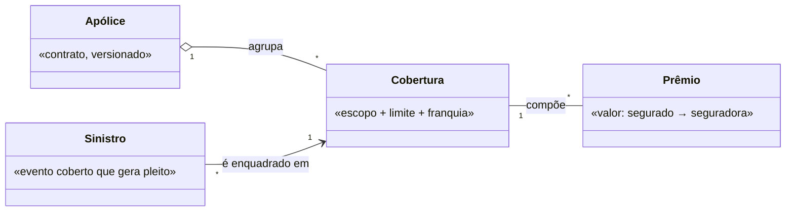

# Modeling the Domain

## Overview

This skill owns the **CONCEPT** layer — the **mental model of the domain**: its **ubiquitous language**, the core **concepts** and how they relate, and the **invariants** that always hold. It works at the **knowledge level** (meaning), never schema or software, as living **design-as-context** that the SOLUTION layer reads.

**The engine is `superpowers:brainstorming`.** This skill adds the altitude (CONCEPT), the target shape, the notation, and the discipline.

## Where this sits — the altitude spine

```
NEED      the problem, before any form
  ↓ reads
CONCEPT   the mental model of the domain   ← THIS SKILL
  ↓ read by
SOLUTION  the conceptual form (north-star:designing-by-altitude)
═══ altitude-stop ═══   schema · services · code · ADR · spec
```

CONCEPT **distills NEED** and is **read by the SOLUTION**. It never draws the solution. For the full spine, see `north-star:designing-by-altitude`; every doc instantiates the **meta-template** (`templates/meta-template.md`).

## The discipline that fails: stay at the knowledge level

Baseline testing showed agents already stop at meaning (they don't descend to columns/types) and handle polysemy well. The discipline that **does** break: under pressure from a **technical team**, they **cross down into the SOLUTION** — adding a "how this becomes code" section that maps concepts to services, schemas, transactions, or tests.

A concept describes **what things mean and the rules that always hold**. *Bounded context, invariant, aggregate as meaning* = CONCEPT. *"becomes a microservice / a table / a test / a transaction boundary"* = you crossed into SOLUTION/spec.

| Rationalization | Reality |
|---|---|
| "So it isn't theory that goes nowhere" | The concept doc earns its keep as the stable anchor every schema and service is validated against — not by drawing them. The mapping is the SOLUTION's job. |
| "The team is technical — make it map to code" | The most actionable thing is precise shared meaning + invariants. Code that breaks an invariant is the bug; name the invariant, not the code. |
| "Bounded contexts are basically the services" | A bounded context is a boundary of *meaning*. Whether it becomes one service is a SOLUTION/ADR decision — leave a pointer. |

If you are naming columns, endpoints, services, or transaction boundaries, you have left this altitude.

## Form — structured prose with Mermaid

- Concepts + relations → `classDiagram`, **conceptual**: NO attributes, NO types. Boxes are concepts; labels are relations-as-meaning (e.g. `Pedido "1" --> "*" Item : contém`).
- A concept map (Novak) → `flowchart` of propositions: `Concept --relation--> Concept`.
- **Avoid `erDiagram`** — it evokes tables/columns and pulls you below the altitude.

## Ubiquitous language — per bounded context

The language is only consistent **within a bounded context**. Always:
- define each term by its **meaning** (not its format/type), with a "not to be confused with";
- when a term shifts sense across contexts, make a **polysemy table** (term × context) — the "false friends". This is the highest-value part of the concept layer (e.g. *prêmio* = what the insured pays, not a reward).

## The shape

**Conceptual domain model** (one per bounded context): 1. **Concepts** (the ubiquitous language). 2. **Concepts + relations** (`classDiagram`). 3. **Invariants** — rules that always hold. 4. **Polysemy** — terms that shift across contexts. 5. **Alternatives + trade-offs**. 6. **Altitude-stop**. 7. **Pointers down**.

**Context Map** (when there are multiple contexts): the contexts, their relationships (partnership, customer/supplier, anticorruption layer, open-host service…) as *meaning*, and which terms are translated across the seams.

## Every doc carries

Focus-question · status markers `[TARGET]/[DECIDED]/[FRONTIER]/[LEGACY]` · reads NEED above as input · the **altitude-stop**. See the meta-template.

## Where they live (convention)

- `docs/design/domain.md` — the conceptual model (or `docs/design/domain-<context>.md` per context).
- `docs/design/context-map.md` — when there are multiple bounded contexts.
- Read by the North Star and subsystem designs (SOLUTION).

## Common mistakes (from baseline testing)

| Mistake | Fix |
|---|---|
| A "how this becomes code/services" section | Stop at meaning + invariants; the mapping is SOLUTION/spec. |
| `erDiagram` / attributes / types | `classDiagram` conceptual; boxes = concepts, no fields. |
| One ubiquitous language for the whole system | Language is per bounded context; add a polysemy table for cross-context terms. |
| Descending to schema because the team is "technical" | The actionable artifact is precise meaning + invariants. |
| Glossary as a flat list | Relations carry meaning — draw concept↔concept with labeled relations. |

## Example



Polysemy (the "false friends"):

| Term | Outside / other area | In this domain |
|---|---|---|
| **Prêmio** | a reward you receive | the price the insured **pays** |
| **Sinistro** | a catastrophe | any covered event that opens a claim |
| **Franquia** | franchising | the insured's retained share of the loss |

*Boxes are concepts, not tables; no attribute is a column. The moment a term needs a type, it belongs to a schema (spec), not here.*
