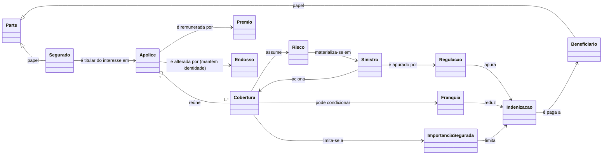

<!--
EXAMPLE for the `modeling-the-domain` skill — the CONCEPT layer.
A lean conceptual domain model in pt-BR (body) with canonical English status markers.
Study the SHAPE: header (Altitude · Axis · Status · Focus-question), ubiquitous language defined
by MEANING (each term with a "não confundir com"), a conceptual classDiagram (NO attributes/types,
NOT erDiagram), invariants, a polysemy table (the "false friends"), alternatives, an explicit
altitude-stop, pointers down — and not a single column, type, table or service. Domain: insurance.
-->

# Modelo Conceitual de Domínio — Seguros (Apólices e Sinistros)

> **Altitude:** CONCEITO · **Eixo:** conceito · **Status:** [TARGET]
> **Pergunta-foco:** O que cada termo do negócio significa e como os conceitos se relacionam — de modo que negócio e engenharia digam a mesma coisa ao dizer "prêmio", "sinistro" ou "cobertura"?
> **Lê acima (NEED):** construir um sistema de apólices e sinistros; alinhar negócio e engenharia sobre o significado dos termos, por anos.

Este documento descreve **significado**, nunca formato. Não há tipos, campos, tabelas, endpoints ou fronteiras de transação aqui — ver §6 e §7.

## Contextos delimitados (bounded contexts)

A linguagem não é única na seguradora — muda de sentido por área:

- **Subscrição & Emissão** `[TARGET]` — o risco é avaliado, aceito e formalizado em contrato.
- **Sinistros** `[TARGET]` — o risco se materializa e a obrigação de indenizar é apurada.
- **Cobrança** `[FRONTIER]` (adjacente) — o prêmio vira obrigação financeira; tratada só como fronteira (§7).

## 1. Conceitos — linguagem ubíqua

Cada termo é definido por **o que é**, seguido de um **"não confundir com"** que demarca a fronteira.

**Subscrição & Emissão**
- **Apólice** — o contrato de seguro; reúne coberturas, vigora no tempo, é alterada por endosso mantendo a identidade. *Não confundir com* o documento/certificado que a representa, nem a proposta (estágio anterior).
- **Cobertura** — a promessa, dentro da apólice, de assumir um risco e indenizar até um limite; a unidade de "o que está protegido". *Não confundir com* a apólice (o todo) nem a indenização (o pagamento).
- **Importância segurada** — o teto que a seguradora pagará por uma cobertura. *Não confundir com* o valor do bem, nem a indenização efetiva.
- **Prêmio** — o preço do seguro; o que o segurado paga à seguradora (entra). *Não confundir com* recompensa (sentido comum) nem indenização (o que sai). Ver §4.
- **Franquia** — a parcela do prejuízo a cargo do segurado, que reduz a indenização. *Não confundir com* carência (tempo) nem franchising. Ver §4.
- **Endosso** — a alteração formal de uma apólice em vigor, preservando a identidade. *Não confundir com* apólice nova nem renovação.
- **Segurado / Beneficiário** — papéis: quem detém o interesse exposto ao risco / quem recebe a indenização. Podem coincidir, mas são distintos.

**Sinistros**
- **Sinistro** — a materialização do risco coberto: (a) o evento; (b) o caso/processo aberto. *Não confundir com* o aviso (a comunicação) nem o risco (ainda incerto). Ver §4.
- **Regulação** — apurar se há cobertura e quantificar o prejuízo. *Não confundir com* liquidação (o pagamento final).
- **Indenização** — o valor que a seguradora paga ao beneficiário, limitado pela importância segurada e reduzido pela franquia (sai). *Não confundir com* prêmio.

## 2. Conceitos + relações

`classDiagram` conceitual — caixas são conceitos, rótulos são relações-como-significado; sem atributos, sem tipos (por isso não `erDiagram`).

## 3. Invariantes (valem sempre)

1. Toda apólice reúne ao menos uma cobertura; uma cobertura só existe dentro de uma apólice.
2. A indenização nunca excede a importância segurada da cobertura acionada, já descontada a franquia.
3. Um sinistro só é indenizável se ocorreu na vigência, enquadra-se numa cobertura, está fora de carência e não recai em exclusão.
4. Endosso pressupõe apólice em vigor; altera-a sem criar outra e sem trocar a identidade.
5. Importância segurada e franquia são por cobertura, não pela apólice; a apólice apenas as agrega.
6. Segurado e beneficiário são papéis distintos (podem ser exercidos pela mesma parte).

## 4. Polissemia — os falsos amigos (termo × contexto)

| Termo | Subscrição & Emissão | Sinistros | Fora do domínio (falso amigo) |
|---|---|---|---|
| **Prêmio** | o preço do seguro (o segurado paga) | — | recompensa / bônus — **NÃO é isso** |
| **Sinistro** | (só o risco, ainda incerto) | o evento **e** o caso/processo | algo funesto, sombrio |
| **Risco** | evento incerto **e** o objeto exposto | já materializado, virou sinistro | risco genérico de projeto |
| **Franquia** | parcela do prejuízo do segurado | valor deduzido da indenização | franchising |
| **Apólice** | o contrato | a referência do que está coberto | o documento impresso |

> O par espelhado central: **prêmio** (entra) ↔ **indenização** (sai). Confundi-los inverte o fluxo de dinheiro do sistema inteiro.

## 5. Alternativas + trade-offs (no nível do significado)

- **Cobertura como conceito de primeira classe** `[DECIDED]` vs. atributo da apólice — escolhida primeira classe (permite importância segurada, franquia e acionamento de sinistro *por cobertura*).
- **Sinistro-evento separado de Regulação-processo** `[DECIDED]` — o evento existe mesmo sem aviso; o processo tem ciclo próprio.
- **Papéis (Segurado/Beneficiário) como papéis de uma Parte** `[DECIDED]` — a mesma pessoa acumula papéis; evita duplicar a pessoa.
- **Prêmio como significado aqui; mecânica de cobrança fora** `[DECIDED]` — parcelas, baixa e inadimplência são do contexto Cobrança (§7); mantém a altitude.

## 6. PARE AQUI (altitude-stop)

Este documento define **significado e regras**. Fora dele: tipos/campos/tabelas/chaves; entidades persistidas, agregados, fronteiras de transação; APIs/eventos/serviços; máquinas de estado implementadas; fórmulas de cálculo de prêmio/franquia. No instante em que nomear uma coluna, um endpoint ou um serviço, saiu da altitude — nomeie a **invariante** em jogo e deixe um ponteiro.

## 7. Ponteiros para baixo

- **Schema / tipos / campos** → spec de persistência + ADR de modelagem (projeta este modelo).
- **Ciclo de vida de apólice e de sinistro** → spec; preserva o significado de "conclusão" e a invariante 3.
- **Cálculo de prêmio e franquia** → spec de pricing.
- **Cobrança (parcelas, faturas, inadimplência)** → bounded context próprio.
- **Cada invariante (§3) → um teste** na camada de implementação (a invariante é o oráculo do teste).
