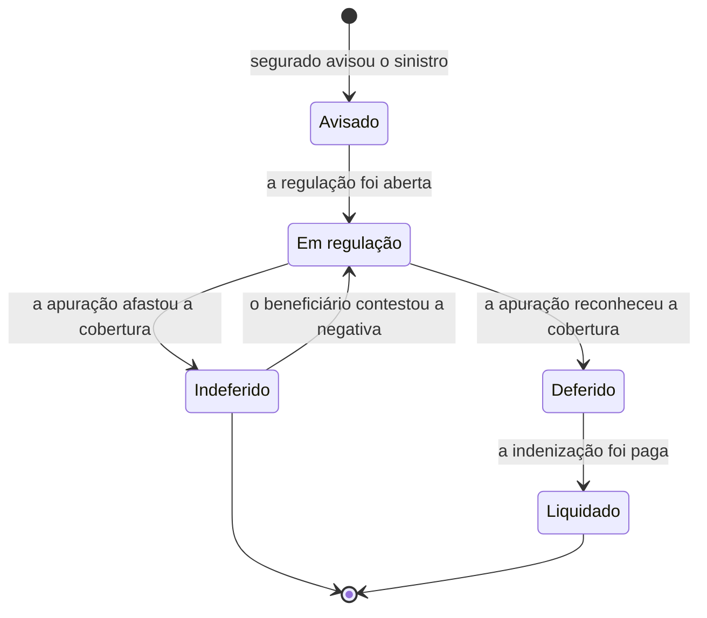

<!--
EXAMPLE for the `narrating-the-flow` skill — the FLOW axis, form = state/lifecycle model (zoom = one entity).
A lean lifecycle in pt-BR (body) with canonical English status markers. Study the SHAPE: states are
BUSINESS SITUATIONS (not an enum or a `status` column), transitions are DOMAIN HAPPENINGS (not methods
or `(state,event)->state`), a `stateDiagram-v2` (boxes = situations, arrows = happenings), invariants on
the moves, an explicit altitude-stop, pointers down — and not a single column, type, method, guard or
topic. Domain: insurance — the *Sinistro* (claim) as a case/process, the same entity `modeling-the-domain`
models as a concept, here in motion.
-->

# Ciclo de Vida do Sinistro — Seguros

> **Altitude:** SOLUÇÃO · **Eixo:** fluxo · **Zoom:** bloco (a entidade *Sinistro*) · **Status:** [TARGET]
> **Pergunta-foco:** Por quais situações de negócio um sinistro passa, e quais acontecimentos do domínio o movem de uma para outra?
> **Lê acima (CONCEITO):** o modelo conceitual de Seguros — *Sinistro* (o evento **e** o caso/processo), *Regulação*, *Indenização*. **Estrutura:** o subsistema de Sinistros do North Star.

Este documento descreve o sinistro **em movimento** — as situações por que o **caso** passa, não os campos que o representam. Estado não é valor de `enum` nem coluna `status`; transição não é método — ver §5 e §6.

## 1. Propósito

Alinhar o time sobre o significado do ciclo de um sinistro: as situações de negócio e os acontecimentos do domínio que o movem. É o que se lê antes de implementar a máquina de estados — e o que cada decisão de implementação deve preservar.

## 2. Premissas / entrada

- **Lê acima (CONCEITO):** usa a linguagem ubíqua do modelo de Seguros. *Sinistro* aqui é o **caso/processo** (não o evento); *Regulação* é a apuração de cobertura e valor; *Indenização* é o pagamento ao beneficiário.
- **Premissa:** o caso nasce quando o sinistro é **avisado** — o evento pode ter ocorrido antes, mas o processo começa na ciência da seguradora.

## 3. Ciclo de vida

Caixas são **situações de negócio**; setas são **acontecimentos do domínio** (algo que ocorreu), nunca chamadas de método.

**As situações (o que é verdade naquele momento):**

| Situação | O que significa |
|---|---|
| **Avisado** | A seguradora tomou ciência do sinistro; ainda não apurou nada. |
| **Em regulação** | A seguradora apura se há cobertura e quantifica o prejuízo. |
| **Deferido** | A apuração reconheceu a cobertura e fixou a indenização devida; falta pagar. |
| **Indeferido** | A apuração concluiu que não há obrigação de indenizar (fora de cobertura, em carência, exclusão ou fora da vigência). |
| **Liquidado** | A indenização foi paga ao beneficiário; a obrigação daquele sinistro cumpriu-se. (terminal) |

**Os acontecimentos** são fatos no passado — "a apuração reconheceu a cobertura", não `aprovar()`. "Reaberto" não é situação: é o acontecimento *o beneficiário contestou a negativa*, que devolve o caso a **Em regulação**.

## 4. Alternativas + trade-offs

- **Indeferido reabrível por contestação** `[FRONTIER]` vs. terminal. *Escolhido reabrível:* a contestação do beneficiário devolve o caso à regulação; a alternativa terminal apagaria o recurso, que é parte do domínio.
- **"Em regulação" como uma situação única** vs. subdividida (triagem · perícia · análise). *Escolhida única:* no nível conceitual o que importa é "está sendo apurado"; a subdivisão é detalhe operacional (spec/runbook).
- **Modelar o caso, não o evento** `[DECIDED]` — coerente com o modelo conceitual, que separa o sinistro-evento do sinistro-caso. O evento é pré-condição do aviso, não uma situação do caso.

## 5. Invariantes (valem sempre — viram testes)

1. Todo caso entra por **Avisado**; não há indenização sem aviso.
2. Só se chega a **Deferido** atravessando **Em regulação** — nenhuma indenização sem apuração.
3. Só se **Liquida** o que foi **Deferido** — não se paga um sinistro não reconhecido.
4. **Liquidado** é terminal: a obrigação daquele sinistro cumpriu-se.
5. A passagem a **Deferido** respeita a invariante do domínio (ocorreu na vigência, enquadra-se numa cobertura, fora de carência, sem exclusão — ver o modelo conceitual).

## 6. PARE AQUI (altitude-stop)

Este documento descreve **situações e acontecimentos**. Não desce a: o `enum`/tipo do estado, a coluna `status`, os campos do registro de sinistro, a tabela `(estado, evento) -> estado`, as guardas em código, os eventos de integração/filas que disparam cada acontecimento, telas ou SLAs de regulação. No instante em que nomear uma coluna, um método ou um tópico, saiu da altitude — nomeie a **situação** e o **acontecimento**, e deixe um ponteiro.

## 7. Ponteiros para baixo

- **A máquina de estados executável e as guardas** → spec de implementação (projeta este ciclo).
- **O `enum`/coluna do estado e os campos do sinistro** → spec de persistência.
- **Cada invariante (§5) → um teste** (a invariante é o oráculo).
- **A subdivisão operacional de "Em regulação"** (triagem/perícia/análise) → spec/runbook.
- **O significado dos conceitos** (*Sinistro*, *Regulação*, *Indenização*) → modelo conceitual (`north-star:modeling-the-domain`).
