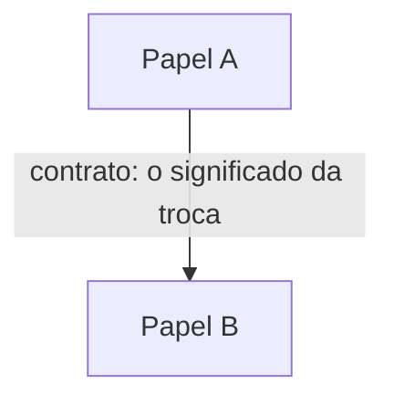

<!--
META-TEMPLATE do toolkit north-star — a anatomia comum.
Copie este molde para criar qualquer documento de design do toolkit.

REGRA-MÃE: prosa estruturada com diagramas Mermaid.
  - a PROSA é a espinha (alma: propósito, princípios, contratos-como-significado, riscos);
  - os DIAGRAMAS Mermaid entram só no §3 (Corpo do eixo) — esqueleto e movimento.
  "Diagrama embeleza o que muda; prosa guarda o que permanece."

Ao instanciar: preencha os <...>, escolha o tipo de diagrama pelo eixo, apague estes comentários.
-->

# <Título do documento>

> **Altitude:** NEED | CONCEITO | SOLUÇÃO  ·  **Eixo:** estrutura | conceito | fluxo | estratégia
> **Status:** [TARGET] | [DECIDED] | [FRONTIER] | [LEGACY]
> **Pergunta-foco:** <a pergunta única que este documento responde>

## 1. Propósito
<!-- PROSA · 1–2 frases: o que este documento é, quem o lê, quando. -->
<...>

## 2. Premissas / entrada
<!-- PROSA · o que toma como dado; lê a altitude acima. -->
- **Lê acima:** <doc(s) da altitude superior, ou "—" se for NEED, o topo>
- **Princípios / invariantes** que toda decisão respeita: <se aplicável>
- **Premissas:** <o que é tomado como dado>

## 3. <Corpo do eixo — renomeie: "Blocos e contratos" | "Fluxo" | "Ciclo de vida" | "Conceitos" ...>
<!-- DIAGRAMA(S) MERMAID + prosa de apoio. Escolha pelo eixo:
       estrutura  → flowchart + subgraph (blocos + contratos, C4-conceitual)
       fluxo      → sequenceDiagram (interação/tick) e/ou flowchart (processo)
       estado     → stateDiagram-v2 (ciclo de vida de UMA entidade)
       conceito   → flowchart / classDiagram conceitual (conceitos + relações rotuladas)
       estratégia → sem diagrama de prateleira: prosa + tabela (opcional quadrantChart)
     Regra: caixas = papéis (não serviços/classes); setas = intenções (não chamadas/assinaturas). -->

<!-- 1–2 linhas de prosa por diagrama: o significado/porquê que o desenho não carrega. -->
<...>

## 4. Alternativas + trade-offs
<!-- PROSA (+ tabela) · os caminhos não tomados, e por quê. -->
- **<Alternativa>** — <por que NÃO> / *escolhida:* <por quê>

## 5. Limitações / riscos / questões em aberto
<!-- PROSA -->
- <...>

## 6. PARE AQUI (altitude-stop)
<!-- PROSA · a linha dura específica deste documento. -->
Este documento descreve <papéis / significado / contratos>. **Não desce a:**
<assinatura, campo, schema, wire format, tecnologia concreta, número de latência> —
isso pertence a um **ADR** (decisão) ou a um **spec** (slice). Deixe um ponteiro, não o detalhe.

## 7. Ponteiros para baixo
<!-- PROSA · links para onde o detalhe vive. -->
- **ADRs:** <...>
- **Specs / planos:** <...>
- **Docs-filhos** (subsystem / zoom): <...>
